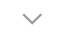

# Customiser votre selectBox
 
Un petit script permettant de customiser de A à Z sans vous compliquer la vie votre SelectBox.

Complètement personnalisable en CSS

L'option de redirection est également disponible en ajoutant method="redirect" à votre classe showOptions

Exemple ci dessous :
<link href="style.css" rel="stylesheet" type="text/css" />

	<input type="hidden" value="" name="exemple" value="" />
	
International

	

	

		Allemagne
		Russie
	

Enjoy
